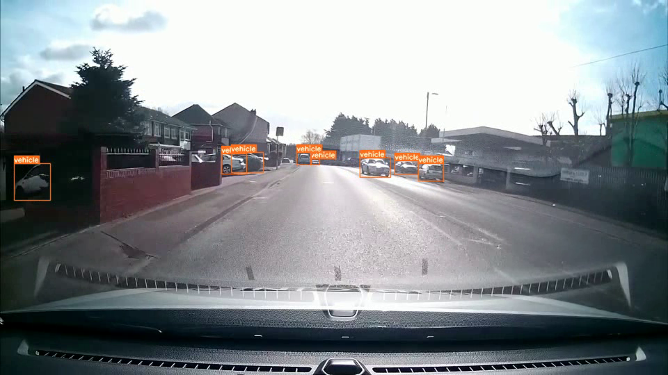
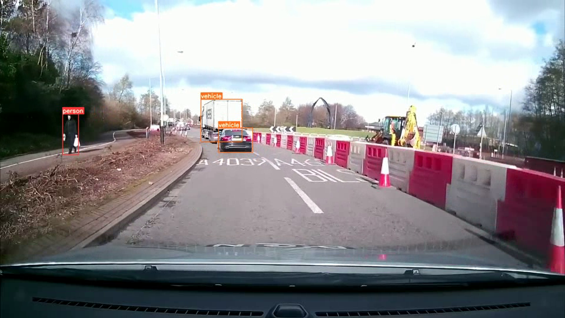
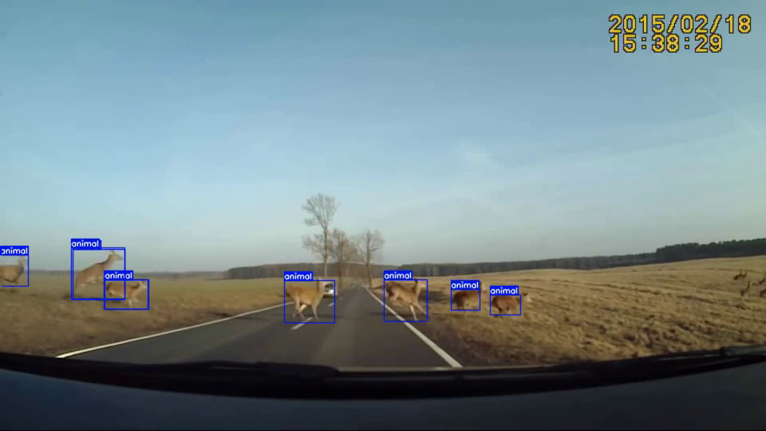

# YOLOV5-AUTONOMOUS

### The results

<div align="center">

 
 
 
</div>

### Clone the repository

```
git clone https://github.com/0102dream/YOLOV5-Autonomous.git
cd YOLOV5-Autonomous
mkdir test
mkdir outputs
```

### Install dependencies

`pip install -r requirements.txt`

### Download test video

```
cd test
gdown --id 17K31zOYolJfXJlt9yQ9sXOSxyMEVmJF_`
cd ..
```

### Run

`python detect.py`
